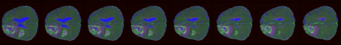

# Improved Glioma Grading using Deep Learning Techniques

## Background

Gliomas are a sort of primary brain tumor that originates from glial cells. These cells are accountable for supporting
the central nervous system of the human body. These tumors vary widely based on their nature, they could be either
malignant or aggressive. The survival rate for a patient with a high-grade tumor is low. Therefore, glioma grading is an
essential part of diagnosis and treatment planning, as it can give critical information regarding the tumor’s
characteristics and its behavior.


## Purpose

Typically, tumor grade is determined by biopsy, which is an invasive and expensive process. Thus, a computer aided
diagnosis (CAD) tool, which is fast, automated, and discreet, is needed for determination of tumor grade. A major
drawback with ML techniques is the need for explicit extraction of features. On the other hand, convolutional neural
networks (CNN) extract the most relevant features from scanned images.

The key difference from other research projects is that an explicit segmentation step is required to locate the tumor
region. Note that this pre-processing step of locating the tumor is challenging. In this project, I have proposed a deep
learning model that helps in eliminating the segmentation step by using an attention layer, which allows you to focus on
the tumor regions automatically. Moreover, classify the tumor whether it is high or low grade.

## In-Depth Documentation

For those interested in learning more about the project, you can explore the following resources:

- **Short Paper**: A concise overview of the methods and results of the
  project. [Short Paper](/resources/Short_Paper.pdf)
- **Detailed Report**: A comprehensive report covering the methodology, experiments, and analysis in
  detail. [Detailed Report](resources/Detailed%20Thesis%20Report.pdf)
- **Research Paper**: A formal research article presented for academic or professional
  purposes. [Research Paper](resources/AIME_Attention_v1.pdf)

These documents provide deeper insights into the project’s objectives, challenges, and outcomes.

## View the project code prerun on Kaggle

Click [here](https://www.kaggle.com/code/sajjaduddin/test-your-model-on-a-single-patient-in-nifti/notebook#Creating-Testing/Validation-Dataset)
to view the project code prerun on Kaggle.

## Getting Started

How to set up and run the project.

### Steps to run with a Kaggle account

1. **Prepare the MRI Scan of input patient**
    - The patient’s dataset should be in a .nii format, and it should contain 3 sequences, namely flair, t1ce, and
      t2. A sample patient dataset shall look like
      this: [Link](https://drive.google.com/drive/folders/1iwjKcridsm9hnkrTI85xJq3-PI1hK3jY?usp=sharing)
    - Sample visualized data looks like this

      

3. **Kaggle Account**

   Create a Kaggle account [here](https://www.kaggle.com/account/login)

3. **Go to project directory**
   [here](https://www.kaggle.com/code/sajjaduddin/test-your-model-on-a-single-patient-in-nifti/notebook#Creating-Testing/Validation-Dataset)

4. **Click on "Copy & Edit"**

   

4. **In the right sidebar, click on "upload" and select your zip file of your patient dataset folder**

   

5. **After uploading, the files should be organized as shown below, with the .nii files placed within the two directories as demonstrated:**

   

6. **Copy the path of your main directory (using the copy icon) and paste it into the "single_test_patient_path" variable section of the code.**

   

7. **Now Run the code 🏃**
    - Run by clicking the "Run all" button in the upper-left corner

    


### Steps to run locally
Note: A GPU is required to run the project locally for optimal performance.
1. **Clone the repository and Navigate to the project directory**
   ```bash
   git clone https://github.com/Sajjad0014/VGG16_with_attention_map.git
   cd VGG16_with_attention_map
2. **Set up the virtual environment**
   ```bash
   python -m venv venv
   source venv/bin/activate  # On Windows: venv\Scripts\activate

3. **Install dependencies**
   ```bash
   pip install -r requirements.txt

4. **Prepare the MRI Scan of input patient**
    - The patient’s dataset should be in a .nii format, and it should contain 3 sequences, namely flair, t1ce, and
      t2.
    - A sample HGG patient dataset shall look like
      this: [Link](https://drive.google.com/drive/folders/1iwjKcridsm9hnkrTI85xJq3-PI1hK3jY?usp=sharing)
    - Copy the .nii files into the Patient_MRI_Scans directory inside the My_Input_Test_Patient folder.

5. **Prepare the BraTS2019 Dataset**
    - Download the dataset from the following Kaggle link: [here](https://www.kaggle.com/datasets/aryashah2k/brain-tumor-segmentation-brats-2019)
    - Extract the contents of the compressed file into your project directory.
    - The structure of the extracted data should look like this:
      C:/Users/YourUsername/ProjectFolder/MICCAI_BraTS_2019_Data_Training/
               

6. **Now Run the code 🏃**
    - If you are using a Jupyter Notebook, open the notebook in Jupyter and click on the "Run All" button in the toolbar to execute all the cells.
    - Alternatively, you can run the notebook from the terminal by using the following command:
    ```bash
    jupyter nbconvert --to notebook --execute test-your-model-on-a-single-patient-in-nifti.ipynb
    ```
    - This will execute the entire notebook and save the output within the notebook file itself.


## Usage

**Determine the grade of the glioma:** Use the trained model to classify gliomas as high or low grade.

**Visualize the tumor region:** Utilize the attention mechanism to highlight and focus on the tumor regions in MRI
scans.
Visualizations should look something like this:


## Results and Evaluation

The model was trained using the BraTS 2018 dataset and subsequently evaluated on a subset of patient data from the BraTS
2019 dataset.

Below are the key insights derived from these evaluations:

- **High-Grade Gliomas (HGG)**: Predictions with F1-score = 74.2%
- **Low-Grade Gliomas (LGG)**: Predictions with F1-score = 42.2%

### Visualization of Patient Evaluations

The following visualizations demonstrate the model’s classification and attention mechanism applied to patient MRI
scans:

- **Patient 1: HGG**
    - **Input MRI**:

      
    - **Tumor Focus (Attention Map)**:

      

- **Patient 2: HGG**
    - **Input MRI**:

      
    - **Tumor Focus (Attention Map)**:

      

- **Patient 3: HGG**
    - **Input MRI**:

      
    - **Tumor Focus (Attention Map)**:

      

- **Patient 4: HGG**
    - **Input MRI**:

      
    - **Tumor Focus (Attention Map)**:

      

- **Patient 5: HGG**
    - **Input MRI**:

      
    - **Tumor Focus (Attention Map)**:

      

- **Patient 6: HGG**
    - **Input MRI**:

      
    - **Tumor Focus (Attention Map)**:

      

- **Patient 7: HGG**
    - **Input MRI**:

      
    - **Tumor Focus (Attention Map)**:

      

- **Patient 8: HGG**
    - **Input MRI**:

      
    - **Tumor Focus (Attention Map)**:

      

- **Patient 9: HGG**
    - **Input MRI**:

      
    - **Tumor Focus (Attention Map)**:

      

- **Patient 10: LGG**
    - **Input MRI**:

      
    - **Tumor Focus (Attention Map)**:

      

- **Patient 11: LGG**
    - **Input MRI**:

      
    - **Tumor Focus (Attention Map)**:

      

### Observations

- The model successfully identifies tumor regions and classifies gliomas with high precision.
- During training, the model was exposed to fewer LGG samples, which likely contributed to the misclassifications in 30.9% of cases. This imbalance led to difficulties in accurately predicting the minority class (LGG), resulting in lower precision and recall for that category.

## Contribution

Contributions to this project are welcome. Please follow the standard procedures for contributing to open-source
projects. If you encounter any issues or have suggestions for improvements, feel free to open an issue or submit a pull
request.
